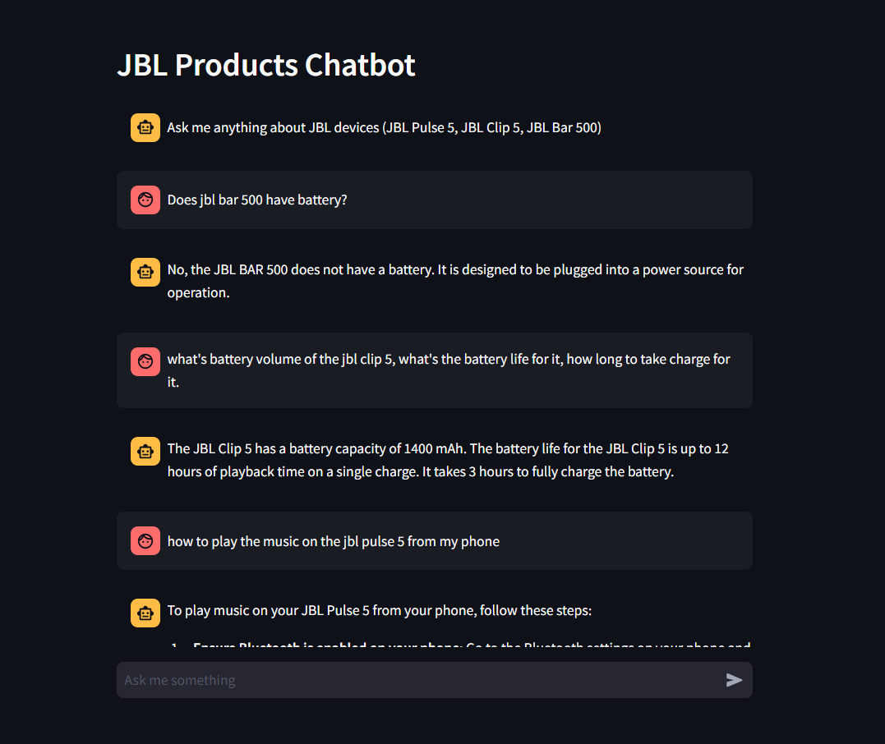

# A RAG Chatbot base on Azure OpenAI 

This is a simple chatbot using `LangChain` and `Azure OpenAI` and `Streamlit` to create a chatbot. The documents are using PDF format files which are JBL products documents. Below is screenshot of the chatbot.



## Technical Stack
- **Azure OpenAI GPT-4**: We will use the GPT-4 language model from Azure OpenAI to generate responses. GPT-4 is a transformer-based language model that is capable of generating coherent and diverse text.
- **LangChain**: LangChain is a Python library that allows us to use the GPT-4 model from Azure OpenAI in our chatbot. LangChain provides a simple interface for building chatbots using GPT-4.
- **Streamlit**: We will use Streamlit to build the chatbot interface. Streamlit is a framework for building web applications in Python. It allows us to create a user-friendly interface for our chatbot.
- **FAISS**: FAISS (Facebook AI Similarity Search) is an open-source library developed by Facebook AI Research. It's designed for efficient similarity search and clustering of high-dimensional data, such as vectors. The primary use case for FAISS is in applications where you need to search for the most similar items to a given query item in large datasets of vectors

## How to run the chatbot?
First, you need to create an account on Azure OpenAI and get your API key. And create a `.env` file in the root directory of the project and add the following line:
```
AZURE_OPENAI_ENDPOINT=<your_endpoint_url>
AZURE_OPENAI_API_VERSION=<your_api_version>
OPENAI_API_KEY=<your_api_key?
AZURE_OPENAI_CHAT_DEPLOYMENT=gpt-4o # we are using gpt-4o model, you can use any other model which you deployed in your endpoint.
AZURE_OPENAI_EMBEDDING_DEPLOYMENT=text-embedding-ada-002 # we are using text-embedding-ada-002 model.
```

Then, you need to install the required libraries using the following command:
```
pip install -r requirements.txt
```

After that, you can proceed to run the chatbot using the following command:
```
streamlit run chatbot.py
```

Accessing "http://localhost:8080" after the application is running.

## Can I use this chatbot for my own purpose?
Yes, absolutely, you can use this chatbot for your own purpose. You can modify the code to suit your needs. You can upload your own documents under `documents` folder, simply update the `config.py` file for vector store.

To process PDF files to FAISS vector store, please run below command:
```
python process_pdfs.py
```

The, you will see the vector store file under `vector_store` folder.